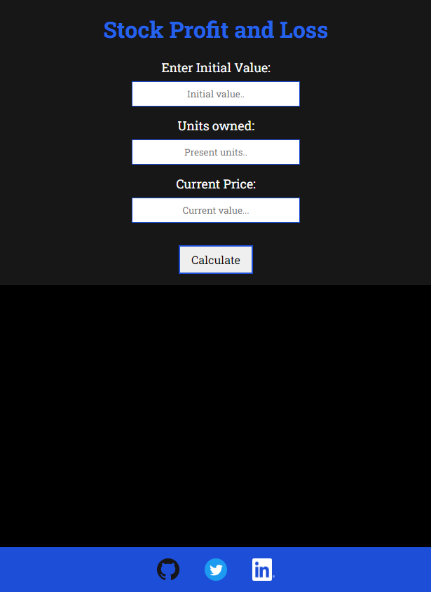

# Stocks Profit & Loss Calculator

## mark-14

This web app helps you to calculate the Profit/loss currently in a stock on your portfolio.

Made in HTML, CSS and Vanilla JS.

Features of site are:

* Tells you profit/loss amount.

* Tells you the percentage of profit/loss.

* **Theme** of site **changes** if *percentage profit/loss > 50%*.

* Site responsive by design.

Visit the website [here.](https://jagrut-stock-profit-loss.netlify.app/)

